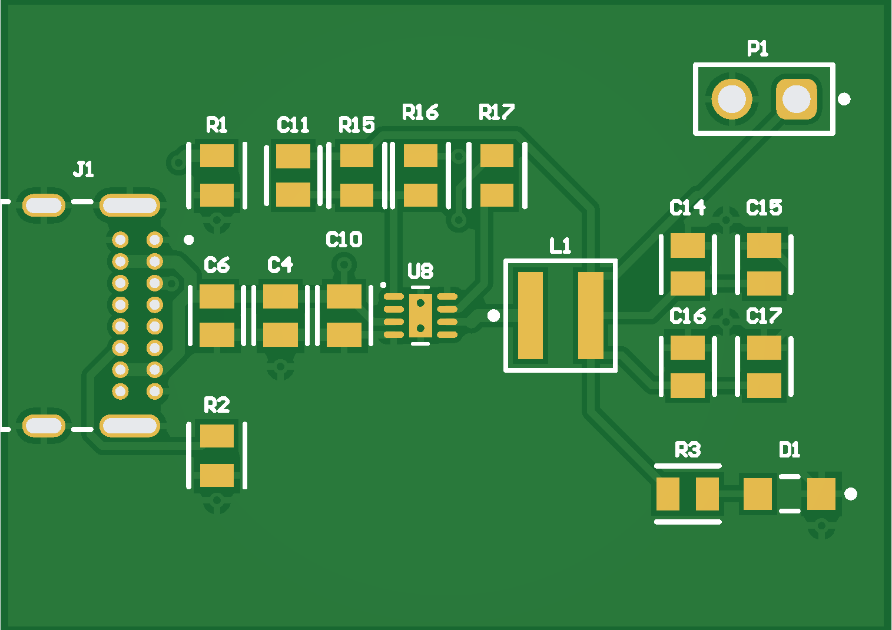
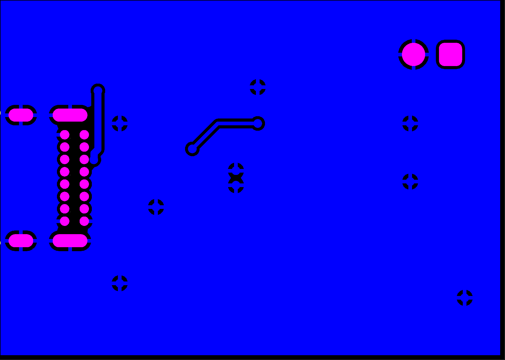

# Power Block: USB-C to 3.3 V buck converter mini-board

A 35 x 25 mm two-layer PCB that takes 5 V from a USB-C cable and produces a regulated 3.3 V on a 2-pin header, with a green LED as a power indicator. It is the M.2 power section of the Raspberry Pi CM5 IO board reference design (CM5IO schematic, Figure 6), rebuilt as a standalone board so I could learn Altium Designer and the full schematic-to-fab flow on a known-good circuit before designing a full CM5 carrier board. The same schematic sheet drops into the carrier project unchanged.

Designed in Altium Designer 26. First board I have taken from schematic to Gerbers.



## Status

| Date | Milestone |
| --- | --- |
| 2026-08-31 | Project created. AP3441 schematic symbol and U-DFN2020-8 footprint built from the datasheet (IPC wizard). |
| 2026-09-03 | Schematic complete and validated. USB-C footprint (GCT USB4085-GF-A) from SnapEDA. ECO to PCB. Board outline, design rules, placement. |
| 2026-09-05 | Routing complete, GND pours top and bottom, stitching vias, DRC clean (0 violations). Gerbers and NC drill generated and verified in JLCPCB's Gerber viewer. |
| Next | Order boards (JLCPCB, 2-layer, 5 pcs) and parts, assemble (hot air for U8 and L1), bring-up. |

Not yet built or tested. This README will be updated with measured results after bring-up.

## Specs

| Item | Value |
| --- | --- |
| Input | 5 V over USB-C (VBUS). 5.1 k pull-downs on CC1 and CC2 request 5 V from any compliant source. |
| Output | 3.3 V (0.6 V x (1 + 10k / 2.2k) = 3.33 V nominal), on 2.54 mm header P1 |
| Regulator | Diodes AP3441, synchronous buck, 1 MHz, 2.7 to 5.5 V in, rated 3 A. This board is laid out for about 1 A (USB-C default current, 0.5 mm power tracks). |
| Board | 35 x 25 mm, 2 layers, 1 oz copper, 1.6 mm FR-4 |
| Parts | 19 (17 surface mount, 2 through-hole) |

## How it works

USB-C connector J1 delivers 5 V on four VBUS pins with four GND pins and four shell tabs for return and mechanical strength. R1 and R2 (5.1 k, one per CC pin, never shared) tell the source this is a sink so it enables VBUS.

C4 and C6 (10 uF) plus C10 (100 nF) sit directly at U8's VIN and PGND pins. The buck pulls its input current in pulses at 1 MHz; the cable cannot supply those, the local caps can.

U8 (AP3441) chops the 5 V input with two internal MOSFETs. Its LX pin is at 5 V for roughly 66% of each 1 us cycle and at 0 V for the rest; the average is 3.3 V. L1 (2.2 uH) turns that square wave into a triangular ripple current, and C14 to C17 (4 x 10 uF) turn the ripple current into a flat output voltage. Together they are a low-pass filter that passes DC and blocks the 1 MHz switching.

R15 (10 k) and R16 (2.2 k) divide the output down to the FB pin. The chip compares FB to its internal 0.6 V reference every cycle and adjusts the duty cycle until FB reads 0.6 V, which puts the output at 3.33 V. C11 (470 pF) across R15 is the feed-forward capacitor for loop stability.

R17 (100 k) pulls EN up to 5 V so the converter is always enabled. R3 (330) and D1 (green LED) draw about 4 mA from the 3.3 V rail as a power indicator. PG and NC are left unconnected, as are the USB data and SBU pins.

## Design decisions (everything else follows the CM5IO reference)

1. **Enable.** On the CM5 IO board, EN is driven by the CM5 (PCIE_PWR_EN) with a 100 k pull-down, so the rail stays off until the module says go. Standalone there is no CM5, so the pull-down is replaced with R17, a 100 k pull-up to 5 V. Within the datasheet limits (EN abs max VIN + 0.3 V; on above 1.5 V).
2. **USB-C input.** Two separate 5.1 k CC pull-downs, one per CC pin. A single shared resistor (the Raspberry Pi 4 mistake) breaks e-marked cables. The pull-downs also guarantee a compliant source never delivers more than 5 V, which matters because the AP3441 is limited to 5.5 V.
3. **Feed-forward cap.** 470 pF, between the CM5IO value (4.7 nF) and the datasheet typical (22 pF). All three work.
4. **LED current.** 330 ohm instead of 1 k for a visible indicator: (3.3 - 2.0) / 330 = 4 mA.

## Layout notes

- Input caps C10, C4, C6 hug U8's VIN and PGND pins: the input loop carries the highest di/dt on the board and is kept as small as possible.
- LX (switch node) is short and wide: 0.3 mm leaving the 0.5 mm pitch DFN pads, 0.5 mm to L1, nothing else routed nearby.
- FB divider (R15, R16, C11) sits near the FB pin; the FB trace is short and routed away from L1 and LX. The 3.3 V sense line taps the output side of L1.
- Power tracks 0.5 mm, signal tracks 0.25 to 0.3 mm, 0.2 mm clearance. Vias 0.6 mm pad / 0.3 mm hole, tented.
- Solid GND pour on both layers with stitching vias, two of them in U8's exposed pad for heat.
- Two nets use the bottom layer: the 5 V feed to R17 and the CC1 line. Everything else is on top.
- Silkscreen: 1 mm designators, 0.15 mm stroke (JLCPCB minimum).
- DRC rules adjusted for a 2-layer JLCPCB board: silk-to-mask and silk-to-silk clearance 0.15 mm, minimum solder mask sliver 0.1 mm (the 0.5 mm pitch DFN and the connector pins fall below the 0.254 mm default; the fab drops those mask bridges), board outline clearance 0.254 mm for copper only.



## Bill of materials

| Ref | Part | Package | MPN (or equivalent) |
| --- | --- | --- | --- |
| U8 | AP3441 synchronous buck, 3 A, 1 MHz | U-DFN2020-8 | AP3441SHE-7B (Diodes) |
| J1 | USB-C receptacle, 16-pin, through-hole | | USB4085-GF-A (GCT) |
| L1 | 2.2 uH shielded power inductor, Isat >= 4 A | 4 x 4 mm | XAL4020-222ME (Coilcraft) |
| C4, C6, C14, C15, C16, C17 | 10 uF 25 V X5R | 0805 | CL21A106KAYNNNE (Samsung) |
| C10 | 100 nF 50 V X7R | 0805 | CL21B104KBCNNNC (Samsung) |
| C11 | 470 pF 50 V C0G/X7R | 0805 | any |
| R1, R2 | 5.1 k 1% | 0805 | RC0805FR-075K1L (Yageo) |
| R15 | 10 k 1% | 0805 | RC0805FR-0710KL |
| R16 | 2.2 k 1% | 0805 | RC0805FR-072K2L |
| R17 | 100 k 1% | 0805 | RC0805FR-07100KL |
| R3 | 330 ohm 1% | 0805 | RC0805FR-07330RL |
| D1 | Green LED | 0805 | LTST-C171KGKT (Lite-On) |
| P1 | 2-pin header, 2.54 mm | through-hole | 61300211121 (Wurth) |

Designators match CM5IO Figure 6 on purpose (hence the gaps), so the sheet can move into the carrier project without renaming.

## Repository layout

```
Power_Block.PrjPcb                 Altium project
PowerBlock.SchDoc                  schematic
PowerBlock.PcbDoc                  PCB layout
PowerBlock.SchLib / .PcbLib        project libraries: own AP3441 symbol + footprint, USB4085 (SnapEDA), passives
Project Outputs for Power_Block/   Gerbers (.GTL .GBL .GTO .GTS .GBS .GTP .GM), NC drill (RoundHoles, SlotHoles), DRC report, JLCPCB upload zip
docs/                              images
```

## Fabrication

JLCPCB, 2 layers, 35 x 25 mm, 1.6 mm, 1 oz, HASL lead-free (ENIG optional), tented vias. Upload `Project Outputs for Power_Block/Powerblock.zip`. Outline comes from Altium's Gerber Board Profile file (.GM); drill data is split into round holes and slots (the connector's shell tabs).

## Assembly

17 surface-mount parts and 2 through-hole. Everything can be hand-soldered with an iron except U8 (DFN, exposed pad underneath) and L1 (bottom-only terminations): those need solder paste and hot air or a hot plate.

## Bring-up checklist

- [ ] Visual under magnification: fillets on all 8 DFN pins, no bridges, pin 1 dot matches the symbol
- [ ] Multimeter: no short between 5V and GND, none between 3V3 and GND
- [ ] Plug in 5 V USB-C: nothing hot, LED on
- [ ] 3V3 rail: 3.23 to 3.43 V (3.33 V nominal, +/-3%)
- [ ] 5V present at C4
- [ ] Load test: 10 ohm 2 W (0.33 A), then 3.3 ohm 5 W (about 1 A); rail holds within 3%, L1 and U8 warm, not hot
- [ ] Scope the output ripple if one is available

## References

- Diodes AP3441 datasheet, DS39754 Rev 3-2 (pinout: 1 FB, 2 PG, 3 VIN, 4 PGND, 5 NC, 6 LX, 7 EN, 8 SGND, EP)
- Raspberry Pi Compute Module 5 IO Board schematic, Figure 6 (M.2 power)
- Phil's Lab #60, Switching Regulator PCB Design

## Author

Aidan Kim, EE sophomore at UC Irvine (class of 2029), UCI Solar Car battery subteam.
